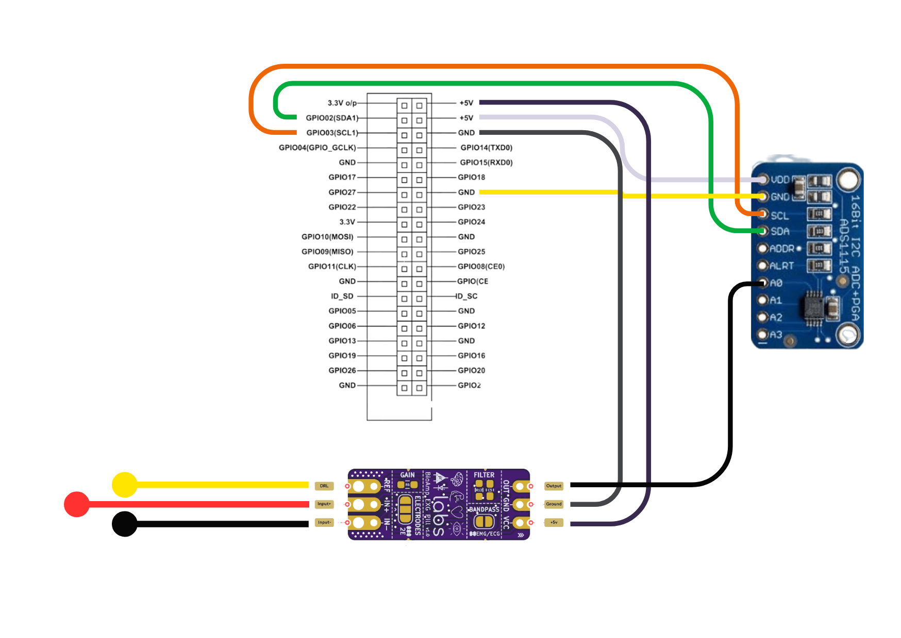

# NeuroSync: Thoughts to Character Conversion Through Deep Learning Ensemble Model

**Batch no:** 1  
**Academic Year:** 2024

## Hardware Requirements

- BioAmp EXG Pill
- Wet electrodes
- Raspberry Pi 3B+
- ADS1115 ADC
- Female to Female Jumper Wires
- MicroSD Card
- Power Adapter
- Monitor
- Keyboard and Mouse

## Hardware Connections

Refer to the provided circuit diagram and make the following connections:

- BioAmp EXG Pill to Raspberry Pi 3B+
- Wet electrodes to BioAmp EXG Pill
- ADS1115 ADC to Raspberry Pi 3B+
- Use female to female jumper wires to connect the necessary GPIO pins as per the circuit diagram.
 


## Setting Up Raspberry Pi OS

### Step 1: Download the Raspberry Pi OS Image

1. Visit the [official Raspberry Pi website](https://www.raspberrypi.org/software/).
2. Download the latest full Raspbian OS image (desktop version).

### Step 2: Write the Image to the SD Card

1. Use a tool like [Etcher](https://www.balena.io/etcher/) or [Win32DiskImager](https://sourceforge.net/projects/win32diskimager/) to write the image to the SD card.
2. Ensure you select the correct drive letter for the SD card to avoid data loss.

### Step 3: Insert the SD Card into the Raspberry Pi

1. Insert the prepared SD card into the Raspberry Pi’s microSD card slot.

### Step 4: Connect the Hardware

1. Connect the power adapter to the Raspberry Pi to power it.
2. Connect the monitor to the Raspberry Pi using an HDMI cable.
3. Connect the keyboard and mouse to the Raspberry Pi via USB ports.

### Step 5: Boot the Raspberry Pi

1. Power on the Raspberry Pi and wait for it to boot.
2. You should see the Raspberry Pi desktop GUI on your monitor.

## Setting Up the Project

### Step 1: Download the Project Folder

1. Open the browser on your Raspberry Pi.
2. Download the project folder from your repository or source.

### Step 2: Create a Python Virtual Environment

1. Open the terminal on your Raspberry Pi.
2. Navigate to the project folder:
    ```python
    cd path/to/your/project/folder
    ```
3. Create a virtual environment using Python 3.12:
    ```bash
    python3.12 -m venv env
    ```

### Step 3: Install Dependencies

1. Activate the virtual environment:
    ```bash
    source env/bin/activate
    ```
2. Install the dependencies from `requirements.txt`:
    ```bash
    pip install -r requirements.txt
    ```

### Step 4: Run the Streamlit App

1. From the project root directory, open the terminal.
2. Run the following command:
    ```bash
    streamlit run scripts/frontend.py
    ```
3. This will open up a locally hosted Streamlit app in the browser.
